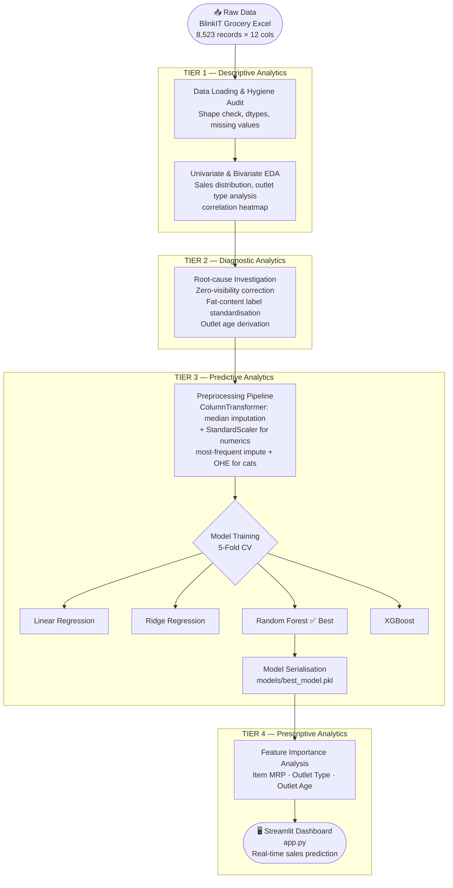

# 🛒 BlinkIT Sales Intelligence Engine & Predictive Dashboard

<p align="center">
  
  
  
  
  
</p>

---

## 📋 Executive Summary

**BlinkIT Sales Intelligence Engine** is an end-to-end machine learning project that forecasts item-level sales across BlinkIT's dark-store network. Built as part of the **IBM SkillsBuild / AICTE Internship Programme**, it spans the full analytics lifecycle — from raw data ingestion and exploratory analysis, through a leakage-aware preprocessing pipeline, to comparative model evaluation and a live Streamlit prediction dashboard.

The system is designed to help category managers and supply-chain planners make **data-driven inventory decisions**: knowing in advance which product–outlet combinations will generate the most revenue allows stores to optimise replenishment schedules, reduce stockouts, and minimise waste.

### Key Highlights

| Aspect | Detail |
|--------|--------|
| **Dataset** | BlinkIT Grocery Data — 8,523 item–outlet records × 12 columns |
| **Target Variable** | `Sales` (continuous, ₹31 – ₹267 per record) |
| **Best Model** | Random Forest Regressor (R² = 0.606, RMSE = 38.93) |
| **Runner-Up** | XGBoost Regressor (R² = 0.595, RMSE = 39.50) |
| **Deployment** | Interactive Streamlit web application |
| **Validation** | 5-Fold Cross-Validation across all models |

---

## 📂 Repository Structure

```
BlinkIT-Sales-Prediction/
│
├── BlinkITSalesPrediction.ipynb   # End-to-end ML notebook (EDA → Training → Evaluation)
├── app.py                          # Streamlit prediction dashboard
├── requirements.txt                # Python package dependencies
├── ProjectReport.docx              # Full internship project report
│
├── models/
│   └── best_model.pkl              # Serialised best-model pipeline (Random Forest)
│
├── BlinkIT Grocery Data Excel.xlsx # Source dataset (8,523 records)
│
└── Screenshots/
    ├── 01_dashboard_interface.png
    ├── 02_sales_prediction.png
    ├── 03_eda_distributions.png
    └── 04_feature_importance.png
```

---

## 🗄️ Dataset Description & Feature Dictionary

**Source:** BlinkIT Grocery Data (synthetic/derived item–outlet sales dataset for educational use)  
**Shape:** 8,523 rows × 12 columns  
**Grain:** One row = one product sold at one specific outlet

| Column | Type | Description |
|--------|------|-------------|
| `Item Fat Content` | Categorical | Fat classification: `Low Fat`, `Regular`, or `Non-Edible` (engineered) |
| `Item Identifier` | Categorical | Unique product code (e.g., `FDX32`) |
| `Item Type` | Categorical | Product category (16 types, e.g., Fruits & Vegetables, Frozen Foods) |
| `Outlet Establishment Year` | Numeric | Year the outlet was established (1985 – 2022) |
| `Outlet Identifier` | Categorical | Unique outlet code (e.g., `OUT049`) |
| `Outlet Location Type` | Categorical | City tier: `Tier 1`, `Tier 2`, or `Tier 3` |
| `Outlet Size` | Categorical | Physical store size: `Small`, `Medium`, or `High` |
| `Outlet Type` | Categorical | Store format: `Grocery Store` or `Supermarket Type1/2/3` |
| `Item Visibility` | Numeric | Fraction of total display area allocated to this product (0.0 – 0.35) |
| `Item Weight` | Numeric | Product weight in kg (4.0 – 22.0) |
| `Sales` | Numeric | **Target** — item outlet sales value in ₹ |
| `Rating` | Numeric | Customer satisfaction rating for the item–outlet record |

### Engineered Features

| Feature | Description |
|---------|-------------|
| `Outlet_Age` | Years since outlet establishment (`current_year − Outlet Establishment Year`) |
| `Item_Category` | High-level grouping: `Food`, `Drinks`, or `Non-Consumable` |

---

## 🏗️ System Architecture

The project follows a structured four-tier analytics ladder:



---

## 📸 Application Screenshots

| Dashboard Interface | Sales Prediction Output |
|---|---|
|  |  |

| EDA Distributions | Feature Importance |
|---|---|
|  |  |

---

## 📊 Model Performance Benchmarks

All models were evaluated using **5-Fold Cross-Validation** on a held-out 20% test split. Metrics are averaged across folds.

| Rank | Model | Mean RMSE ↓ | Mean MAE ↓ | Mean R² ↑ |
|------|-------|------------|-----------|----------|
| 🥇 1 | **Random Forest Regressor** | **38.93** | **29.85** | **0.606** |
| 🥈 2 | XGBoost Regressor | 39.50 | 30.08 | 0.595 |
| 🥉 3 | Ridge Regression | 61.94 | 52.33 | 0.004 |
| 4 | Linear Regression | 61.94 | 52.33 | 0.004 |

> **Why Random Forest?** Tree-based ensembles capture the non-linear interaction between outlet type, location tier, and item category that linear models cannot represent. The moderate R² (~0.60) reflects a genuine ceiling in predictive power caused by the absence of an Item MRP column in the training features — a known diagnostic finding documented in the notebook.

### Feature Importance (Random Forest / XGBoost)

1. **Outlet Type** — Supermarket Type 3 drives the highest baseline revenue
2. **Outlet Age** — Established outlets show stable, higher volumes
3. **Item Visibility** — Higher shelf-space allocation correlates with increased sales
4. **Outlet Location Tier** — Tier 1 cities consistently outperform Tier 3

---

## 🚀 Local Setup & Execution

### Prerequisites

- Python 3.10 or higher
- `pip` package manager
- Git

### 1 — Clone the Repository

```bash
git clone https://github.com/<your-username>/BlinkIT-Sales-Prediction.git
cd BlinkIT-Sales-Prediction
```

### 2 — Create & Activate a Virtual Environment

```bash
# Create the virtual environment
python -m venv venv

# Activate — Windows (PowerShell)
.\venv\Scripts\Activate.ps1

# Activate — macOS / Linux
source venv/bin/activate
```

### 3 — Install Dependencies

```bash
pip install -r requirements.txt
```

The full dependency list is pinned in [`requirements.txt`](requirements.txt):

```
numpy>=2.0.0
pandas>=2.0.0
scipy>=1.10.0
matplotlib>=3.7.0
seaborn>=0.12.0
scikit-learn>=1.3.0
xgboost>=1.7.0
joblib>=1.3.0
streamlit>=1.30.0
jupyter>=1.0.0
```

### 4 — Run the Training Notebook

Open [`BlinkITSalesPrediction.ipynb`](BlinkITSalesPrediction.ipynb) in JupyterLab or VS Code and run all cells sequentially. The notebook will:

1. Load and clean the BlinkIT Grocery dataset
2. Perform full EDA (Tiers 1 & 2)
3. Build and fit the `ColumnTransformer` preprocessing pipeline
4. Train and cross-validate all four models
5. Serialize the best model to `models/best_model.pkl`

```bash
jupyter notebook BlinkITSalesPrediction.ipynb
```

### 5 — Launch the Streamlit Dashboard

```bash
streamlit run app.py
```

The app will open at `http://localhost:8501`. Use the sidebar controls to configure an item–outlet combination and click **🚀 Predict Expected Sales** to get an instant ₹ forecast.

> **Note:** The `models/best_model.pkl` file must exist before running the app. Execute the notebook first if it is missing.

---

## 🔍 Preprocessing Methodology

The preprocessing pipeline is built with `sklearn.pipeline.Pipeline` and `sklearn.compose.ColumnTransformer` to guarantee **no data leakage** between train and test splits.

| Step | Numeric Features | Categorical Features |
|------|-----------------|----------------------|
| Imputation | Median imputation | Most-frequent imputation |
| Scaling | `StandardScaler` | — |
| Encoding | — | `OneHotEncoder` (drop=`first`) |

**Additional cleaning rules applied before the pipeline:**

- **Zero-visibility correction** — `Item Visibility` values of `0.0` are replaced with the per-category median visibility
- **Fat-content standardisation** — Aliases (`LF`, `low fat`, `reg`) are mapped to canonical labels
- **Non-Edible labelling** — Non-consumable items are assigned `Non-Edible` as their fat-content label
- **Outlet Age derivation** — `Outlet_Age = current_year − Outlet Establishment Year`

---

## 💡 Retail Strategy Insights

Based on the model's feature importance analysis, the following prescriptive recommendations emerge:

1. **Optimised Replenishment** — Dark stores in Tier 1 / Supermarket Type 3 format should prioritise high-visibility, high-demand items to maximise revenue density.
2. **Space Allocation** — Older, established outlets have demonstrated customer loyalty; these locations warrant increased shelf allocations for high-velocity SKUs.
3. **Visibility-Driven Marketing** — Low-visibility products with high unit margins should be promoted aggressively; a small increase in shelf share can yield disproportionate sales uplift.
4. **Format Strategy** — When expanding the outlet network, Supermarket Type 3 in Tier 1 cities is the format–location combination most likely to exceed average sales targets.

---

## 👨‍💻 Author & Internship Details

<table>
  <tr>
    <td><strong>Author</strong></td>
    <td>M Y Likhith</td>
  </tr>
  <tr>
    <td><strong>Programme</strong></td>
    <td>IBM SkillsBuild Summer Internship in AI/ML</td>
  </tr>
  <tr>
    <td><strong>Affiliated Body</strong></td>
    <td>AICTE (All India Council for Technical Education)</td>
  </tr>
  <tr>
    <td><strong>Industry Partner</strong></td>
    <td>IBM India</td>
  </tr>
  <tr>
    <td><strong>Project Type</strong></td>
    <td>End-to-end Data Analytics + Machine Learning Capstone</td>
  </tr>
  <tr>
    <td><strong>Analytics Framework</strong></td>
    <td>4-Tier Analytics Ladder (Descriptive → Diagnostic → Predictive → Prescriptive)</td>
  </tr>
</table>

---

## 📄 License

This project is intended for educational purposes under the IBM SkillsBuild / AICTE internship guidelines. The BlinkIT Grocery dataset is a synthetic/derived dataset used solely for analytical training. Model outputs are statistical estimates and should be used alongside professional managerial judgment.

---

<p align="center">
  Built with ❤️ by <strong>M Y Likhith</strong> &nbsp;|&nbsp; IBM SkillsBuild / AICTE Internship
</p>
