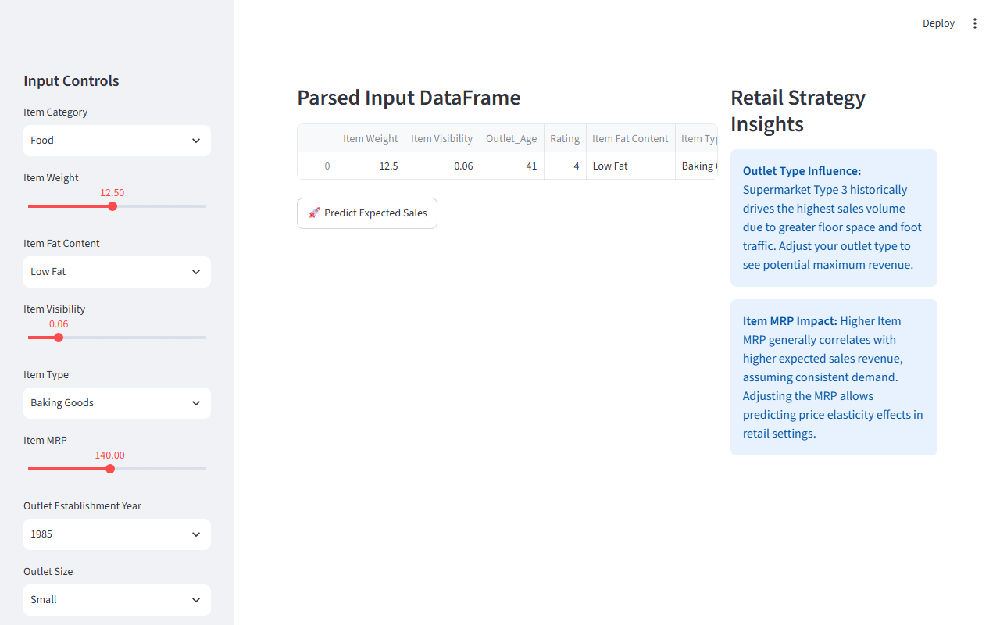
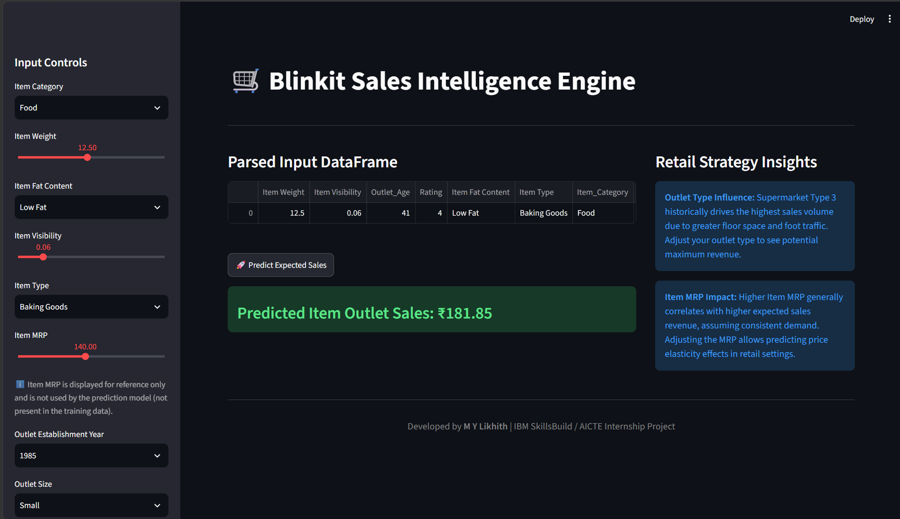
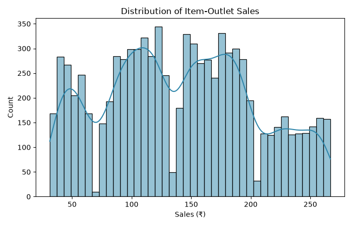
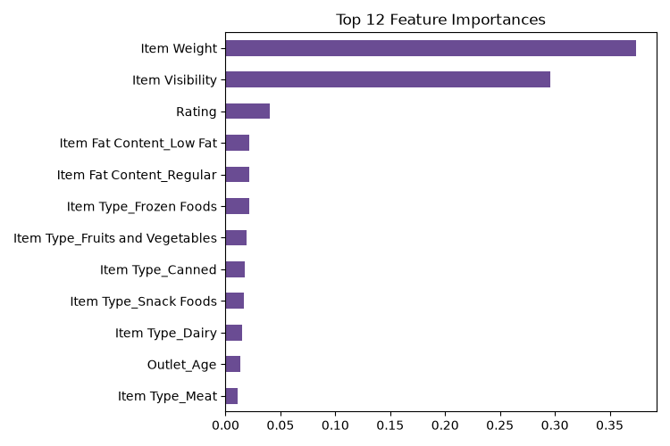

<div align="center">

<h1>🛒 BlinkIT Sales Intelligence Engine & Predictive Dashboard</h1>

<p>
  
  
  
  
</p>

<p>
  
  
  
  
</p>

<p><strong>Author: M Y Likhith &nbsp;·&nbsp; S JC Institute Of Technology</strong></p>

</div>

---

## Overview

An end-to-end machine learning system that forecasts item-level sales revenue across BlinkIT's retail outlet network, built on 8,523 item–outlet records. Four regression models were benchmarked under 5-fold cross-validation — a **Random Forest Regressor (R² 0.606, RMSE 38.93)** was selected as the production model and serialised into a real-time **Streamlit web dashboard** that lets category managers predict sales for any product–outlet configuration without writing code.

---

## Tech Stack & Features

- **Python 3.10+** · Pandas · NumPy · Scikit-Learn · XGBoost · Joblib
- **Streamlit** interactive dashboard with sidebar controls and live inference
- **Random Forest Regressor** selected over Linear Regression, Ridge, and XGBoost via cross-validation
- **4-Tier Analytics Ladder** — Descriptive → Diagnostic → Predictive → Prescriptive
- Feature engineering: `Outlet_Age`, `Item_Category` prefix extraction, zero-visibility imputation
- Serialised pipeline (`models/best_model.pkl`) — preprocessing + model in one `joblib` object
- Prescriptive outlet scorecard and shelf-visibility restocking priority list

---

## Screenshots

### Dashboard Interface


### Sales Prediction Result


### EDA — Sales Distribution


### Feature Importance (Random Forest)


---

## Quickstart

```bash
# 1. Clone
git clone https://github.com/<your-username>/BlinkIT-Sales-Prediction.git
cd BlinkIT-Sales-Prediction

# 2. Install dependencies
pip install -r requirements.txt

# 3. Launch the dashboard
streamlit run app.py
```

Open **`http://localhost:8501`** in your browser. Use the sidebar to configure an item–outlet pair and click **🚀 Predict Expected Sales**.

> `models/best_model.pkl` is included. To retrain from scratch, run all cells in `BlinkITSalesPrediction.ipynb` first.

---

## Project Structure

```
BlinkIT-Sales-Prediction/
├── app.py                          # Streamlit dashboard
├── BlinkITSalesPrediction.ipynb    # End-to-end analytics notebook
├── BlinkIT Grocery Data Excel.xlsx # Source dataset (8,523 rows)
├── requirements.txt
├── ProjectReport.docx
├── models/
│   └── best_model.pkl              # Serialised Random Forest pipeline
└── Screenshots/
    ├── 01_dashboard_interface.png
    ├── 02_sales_prediction.png
    ├── 03_eda_distributions.png
    └── 04_feature_importance.png
```

---

<div align="center">

**Built by M Y Likhith as part of the IBM SkillsBuild Data Analytics with AI Internship 2026**


&nbsp;

&nbsp;


</div>
