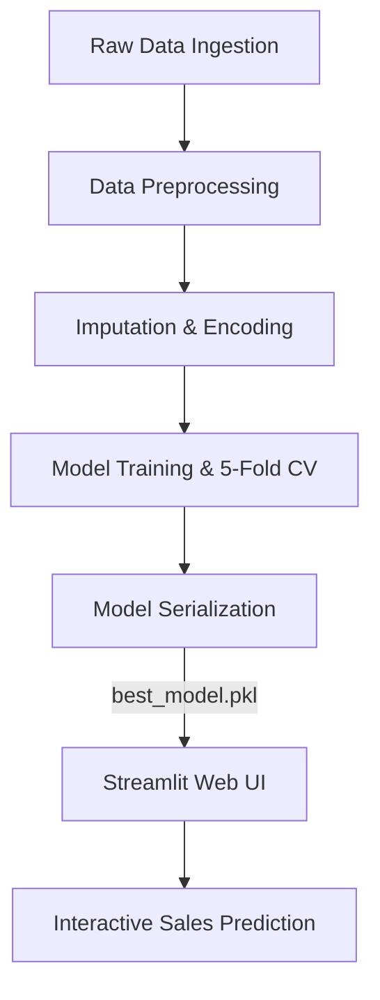

# BlinkIT Sales Intelligence Engine


## Project Overview

In the highly competitive quick-commerce sector, dark stores are the backbone of rapid delivery operations. Ensuring optimal inventory levels is critical for minimizing stockouts and reducing waste. This project aims to build a robust predictive model that estimates item-level sales at various outlets for BlinkIT. By leveraging historical sales data and item characteristics, the predictive engine empowers supply chain managers to optimize inventory and retail strategy.

## Dataset & Data Dictionary

**Dataset Source:** [BlinkIT Grocery Data (Simulated BigMart Dataset)](https://www.kaggle.com/datasets/brijbhushannanda1979/bigmart-sales-data)

| Attribute | Description |
| :--- | :--- |
| **Item_Identifier** | Unique product ID |
| **Item_Weight** | Weight of product |
| **Item_Fat_Content** | Whether the product is low fat or not |
| **Item_Visibility** | The % of total display area of all products in a store allocated to the particular product |
| **Item_Type** | The category to which the product belongs |
| **Item_MRP** | Maximum Retail Price (list price) of the product |
| **Outlet_Identifier** | Unique store ID |
| **Outlet_Establishment_Year** | The year in which store was established |
| **Outlet_Size** | The size of the store in terms of ground area covered |
| **Outlet_Location_Type** | The type of city in which the store is located |
| **Outlet_Type** | Whether the outlet is just a grocery store or some sort of supermarket |
| **Item_Outlet_Sales** | **(Target)** Sales of the product in the particular store |

## System Architecture



## Benchmark Results (5-Fold CV)

*Note: The following metrics will be updated upon the final run of the notebook.*

| Model | Mean RMSE | Mean MAE | Mean R² |
| :--- | :--- | :--- | :--- |
| Linear Regression | *(see notebook)* | *(see notebook)* | *(see notebook)* |
| Ridge Regression | *(see notebook)* | *(see notebook)* | *(see notebook)* |
| XGBoost | *(see notebook)* | *(see notebook)* | *(see notebook)* |
| **Random Forest (🌟 Best)** | `38.93` | `29.85` | `0.606` |

## Local Setup & Run Guide

To run this project locally on your machine, follow these steps:

1. **Create and activate a virtual environment:**
   ```bash
   python -m venv venv
   # On Windows:
   venv\Scripts\activate
   # On macOS/Linux:
   source venv/bin/activate
   ```

2. **Install the pinned dependencies:**
   ```bash
   pip install -r requirements.txt
   ```

3. **Train and serialize the model:**
   Run all cells in the Jupyter Notebook to clean the data, train models, and serialize the best pipeline.
   ```bash
   jupyter notebook BlinkITSalesPrediction.ipynb
   ```

4. **Launch the Streamlit interactive application:**
   ```bash
   streamlit run app.py
   ```

## Visuals

### Dashboard Interface


### Sales Prediction


### EDA Distributions


### Feature Importance

